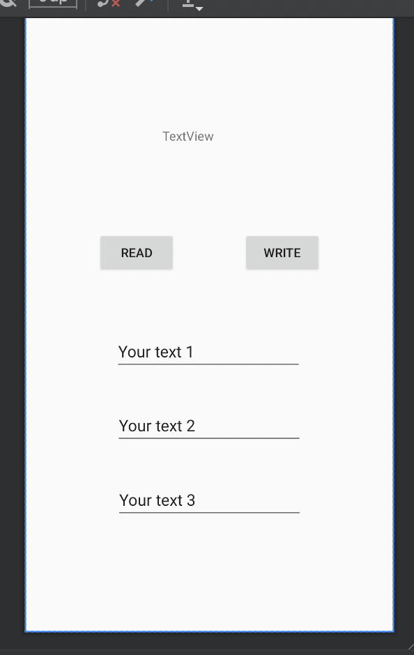

# Rapport

At first I created a DatabaseTables class for creating and deleting tables and one
inner class for each table where each inner class have constants for table and column names.
```
class DatabaseTables {

    static class Bonsai {

        static final String TABLE_NAME = "bonsai";
        static final String COLUMN_NAME_ID = "id";
        static final String COLUMN_NAME_NAME = "name";
        static final String COLUMN_NAME_AGE = "age";

        public Bonsai(long aLong, String string, int anInt) {
        }
    }

    static final String SQL_CREATE_TABLE_BONSAI =
            // "CREATE TABLE bonsai (id INTEGER PRIMARY KEY, name TEXT, height INT)"
            "CREATE TABLE " + Bonsai.TABLE_NAME + " (" +
                    Bonsai.COLUMN_NAME_ID + " INTEGER PRIMARY KEY," +
                    Bonsai.COLUMN_NAME_NAME + " TEXT," +
                    Bonsai.COLUMN_NAME_AGE + " INT)";

    static final String SQL_DELETE_TABLE_BONSAI =
            // "DROP TABLE IF EXISTS bonsai"
            "DROP TABLE IF EXISTS " + Bonsai.TABLE_NAME;

}
```

After that I created a second helper class DatabaseHelper which extends (inherits) from 
`SQLiteOpenHelper` to help with the lifecycle of the database. I implemented `onCreate()` and
`onUpgrade()` methods to  determine which tables will be created and deleted and when. 

```
public class DatabaseHelper extends SQLiteOpenHelper {


    private static final int DATABASE_VERSION = 1; // If this is incremented onUpgrade() will be executed
    private static final String DATABASE_NAME = "Bonsai.db"; // The file name of our database

    DatabaseHelper(Context context) {
        super(context, DATABASE_NAME, null, DATABASE_VERSION);
    }


    // This method is executed only if there is not already a database in the file `Bonsai.db`
    @Override
    public void onCreate(SQLiteDatabase sqLiteDatabase) {
        sqLiteDatabase.execSQL(DatabaseTables.SQL_CREATE_TABLE_BONSAI);
    }

    // This method is executed only if the database version has changed, e.g. from 1 to 2
    @Override
    public void onUpgrade(SQLiteDatabase sqLiteDatabase, int oldVersion, int newVersion) {
        sqLiteDatabase.execSQL(DatabaseTables.SQL_DELETE_TABLE_BONSAI);
        onCreate(sqLiteDatabase);
    }

}
```

After that I creates an instanced the helper and invoked the `getWritableDatabase()` method.
```
public class SqliteActivity extends AppCompatActivity {
    private SQLiteDatabase database;
    private DatabaseHelper databaseHelper;

    @Override
    protected void onCreate(Bundle savedInstanceState) {
        super.onCreate(savedInstanceState);
        setContentView(R.layout.activity_sqlite);

        // Create
        databaseHelper = new DatabaseHelper(this);
        database = databaseHelper.getWritableDatabase();
    }
}
```

To add data I used the `insert` method on the database instance in the MainActivity.

```
 private long addMountain(String name, int height) {
        ContentValues values = new ContentValues();
        values.put(DatabaseTables.Bonsai.COLUMN_NAME_NAME, name);
        values.put(DatabaseTables.Bonsai.COLUMN_NAME_AGE, height);
        return database.insert(DatabaseTables.Bonsai.TABLE_NAME, null, values);
    }
```

To fetch or select rows I used the `select` method on the database instance in MainActivity.
```
private List<DatabaseTables.Bonsai> getMountains() {
        Cursor cursor = database.query(DatabaseTables.Bonsai.TABLE_NAME, null, null, null, null, null, null);
        List<DatabaseTables.Bonsai> mountains = new ArrayList<>();
        while (cursor.moveToNext()) {
            DatabaseTables.Bonsai mountain = new DatabaseTables.Bonsai(
                    cursor.getLong(cursor.getColumnIndexOrThrow(DatabaseTables.Bonsai.COLUMN_NAME_ID)),
                    cursor.getString(cursor.getColumnIndexOrThrow(DatabaseTables.Bonsai.COLUMN_NAME_NAME)),
                    cursor.getInt(cursor.getColumnIndexOrThrow(DatabaseTables.Bonsai.COLUMN_NAME_AGE))
            );
            mountains.add(mountain);
        }
        cursor.close();
        return bonsai;
    }
```

To be able to delete data I used this part of the code:
```
private int deleteBonsai(long id) {
        String selection = DatabaseTables.Bonsai.COLUMN_NAME_ID + " = ?";
        String[] selectionArgs = { String.valueOf(id) };
        return database.delete(DatabaseTables.Bonsai.TABLE_NAME, selection, selectionArgs);
    }
```

It hasn't worked as expected based on some issues with 'insert' and 'delete' methods in MainActivity.

This is my layout for the SQlite exercise.



Läs gärna:

- Boulos, M.N.K., Warren, J., Gong, J. & Yue, P. (2010) Web GIS in practice VIII: HTML5 and the canvas element for interactive online mapping. International journal of health geographics 9, 14. Shin, Y. &
- Wunsche, B.C. (2013) A smartphone-based golf simulation exercise game for supporting arthritis patients. 2013 28th International Conference of Image and Vision Computing New Zealand (IVCNZ), IEEE, pp. 459–464.
- Wohlin, C., Runeson, P., Höst, M., Ohlsson, M.C., Regnell, B., Wesslén, A. (2012) Experimentation in Software Engineering, Berlin, Heidelberg: Springer Berlin Heidelberg.
